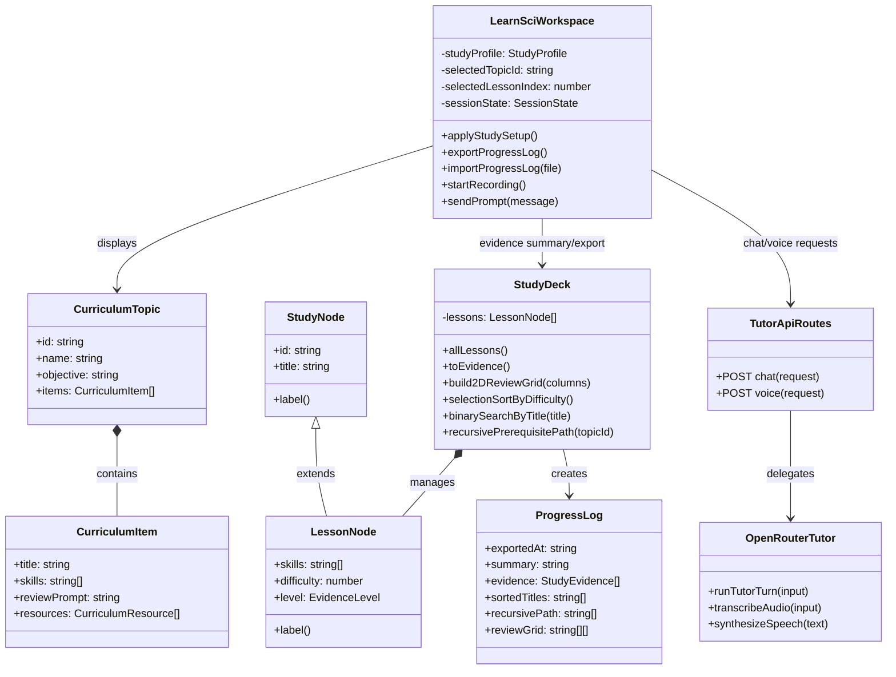

# LearnSci UML Diagram

## Relationship Summary

- `LessonNode` inherits from `StudyNode` and overrides `label()`.
- `StudyDeck` composes many `LessonNode` objects and runs the rubric algorithms.
- `LearnSciWorkspace` connects the GUI, tldraw canvas, voice input, file input/output, and AI tutor routes.

